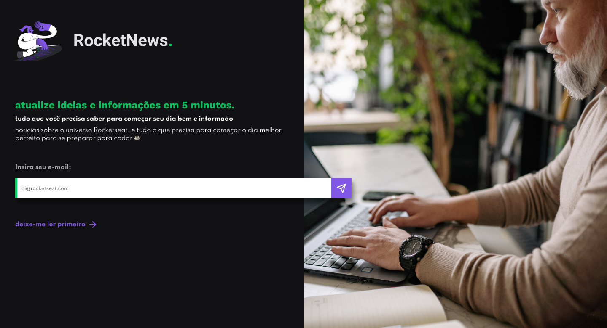

<h1 align="center">RocketNews</h1>

Programa exclusivo e  gratuito, promovido pela Rocketseat para ensino de tecnologias WEB.

  <a href="#-tecnologias">Tecnologias</a>&nbsp;&nbsp;&nbsp;|&nbsp;&nbsp;&nbsp;
  <a href="#-projeto">Projeto</a>&nbsp;&nbsp;&nbsp;|&nbsp;&nbsp;&nbsp;
  <a href="#-layout">Layout</a>&nbsp;&nbsp;&nbsp;|&nbsp;&nbsp;&nbsp;
  <a href="#memo-licença">Licença</a>

  

 

  

## 🚀 Tecnologias

Esse projeto foi desenvolvido com as seguintes tecnologias:

- HTML e CSS
- Git e Github
- Figma
- Tailwind CSS

## 💻 Projeto

Projeto feito seguindo o desafio da Rocketseat com base no figma, meus primeiro projetos com Tailwind CSS para estudar a ferramenta.

## 🔖 Layout

Você pode visualizar o layout do projeto através [DESSE LINK](https://www.figma.com/file/BRsO7Va8MNrdSIJMzxGBHR/RocketNews-%E2%80%A2-Desafio-Discover-(Community)?node-id=101%3A2&mode=dev). É necessário ter conta no [Figma](https://figma.com) para acessá-lo.

## :memo: Licença

Esse projeto está sob a licença MIT.

---

Feito com ♥ by Kaio Torres :wave: [Veja meu cartão de visita](https://kaiotorrers19.github.io/projeto_apresentacao_portifolio-/)
